# Hướng dẫn Content Editor

Hướng dẫn này dành cho người biên tập nội dung website. Chỉ làm những việc có trong vai trò **Content Editor**.

## Mục lục

1. [Bắt đầu nhanh](#bắt-đầu-nhanh)
2. [Quyền hạn và giới hạn](#quyền-hạn-và-giới-hạn)
3. [Trạng thái nội dung](#trạng-thái-nội-dung)
4. [Chọn luồng đúng](#chọn-luồng-đúng)
5. [Hai mục đơn lẻ](#hai-mục-đơn-lẻ)
6. [Bảy nhóm nội dung lặp lại](#bảy-nhóm-nội-dung-lặp-lại)
7. [Điều kiện để Published](#điều-kiện-để-published)
8. [Nội dung song ngữ và đường dẫn](#nội-dung-song-ngữ-và-đường-dẫn)
9. [Hình ảnh trong Public CMS](#hình-ảnh-trong-public-cms)
10. [Quan hệ nội dung](#quan-hệ-nội-dung)
11. [Quy trình xuất bản và lưu trữ](#quy-trình-xuất-bản-và-lưu-trữ)
12. [Lỗi thường gặp](#lỗi-thường-gặp)
13. [Danh sách kiểm tra](#danh-sách-kiểm-tra)
14. [Khi nào cần báo quản trị viên](#khi-nào-cần-báo-quản-trị-viên)

## Bắt đầu nhanh

1. Đăng nhập vào **Data Studio** bằng tài khoản được cấp.
2. Mở thanh điều hướng bên trái. Chọn **Site Settings**, **Home Page** hoặc một nhóm nội dung.
3. Dùng ô tìm kiếm để tìm theo tên hoặc tiêu đề. Dùng bộ lọc trạng thái khi cần tìm bản nháp hay nội dung đã xuất bản.
4. Chọn một hàng để sửa. Chọn **Tạo mới** để thêm nội dung lặp lại.
5. Chọn **Lưu** trước khi rời trang. Kết quả: thay đổi được giữ ở trạng thái hiện tại.

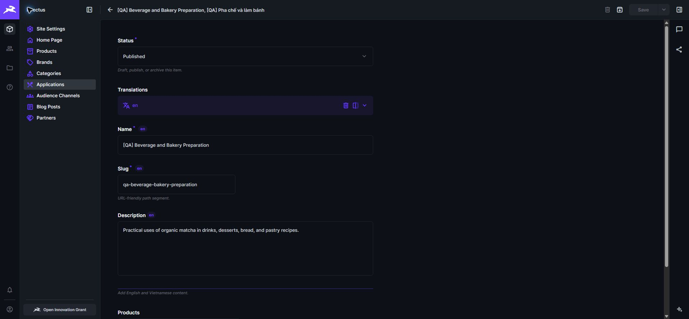

*Ảnh giao diện 1 — Thanh điều hướng chỉ hiển thị các nhóm nội dung dành cho Content Editor.*

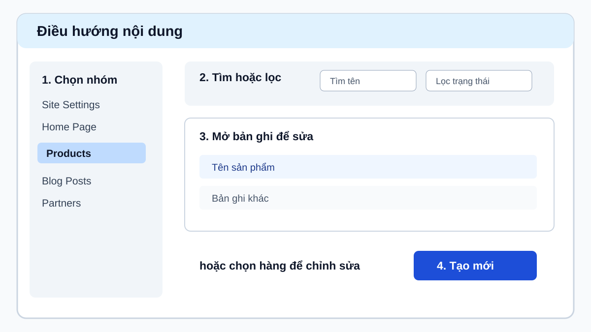

*Hình 1. Mở nhóm nội dung, tìm hoặc lọc bản ghi, rồi tạo mới hay chỉnh sửa.*

## Quyền hạn và giới hạn

Bạn có thể:

- Cập nhật hai mục đơn lẻ **Site Settings** và **Home Page**.
- Tạo, sửa, lưu nháp, xuất bản và lưu trữ bảy nhóm nội dung lặp lại cùng bản dịch tiếng Anh và tiếng Việt.
- Chọn hoặc thay **Brand**; gắn hoặc bỏ **Categories**, **Applications** và **Audience Channels** cho sản phẩm. **Brand** là bắt buộc và phải **Published**.
- Chọn, tải lên và cập nhật hình trong thư mục **Public CMS**.

Bạn không thể:

- Xóa vĩnh viễn nội dung hoặc tệp.
- Đổi danh sách ngôn ngữ, quyền, người dùng hay thiết lập hệ thống.
- Dùng hình ngoài thư mục **Public CMS**.

Không thấy nút xóa là đúng với quyền hiện có. Dùng **Archived** để gỡ nội dung khỏi website.

## Trạng thái nội dung

- **Draft**: đang soạn; chưa hiển thị công khai.
- **Published**: đã sẵn sàng; có thể hiển thị trên website.
- **Archived**: ngừng dùng; gỡ khỏi website nhưng không xóa vĩnh viễn.

Khi mở một mục, xem trường **Status** trước khi sửa. Sau khi lưu, tải lại danh sách và kiểm tra trạng thái hiển thị đúng.

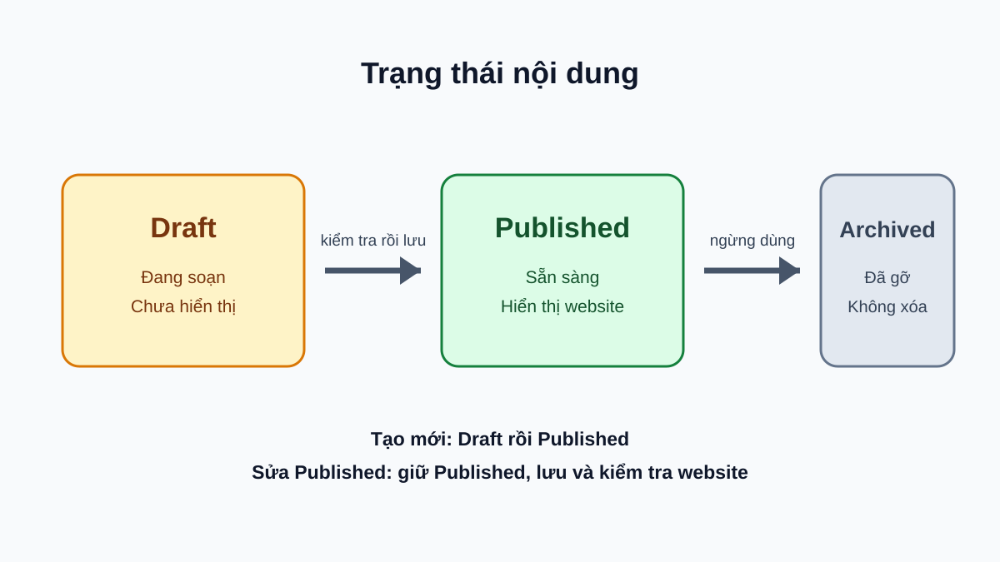

*Hình 2. Draft dành cho nội dung mới đang soạn; Published hiển thị trên website; Archived dùng để gỡ nội dung.*

## Chọn luồng đúng

**Tạo mới:** chọn **Tạo mới**, điền nội dung, lưu **Draft**, kiểm tra đầy đủ, chuyển **Published**, rồi mở website.

**Sửa mục đang Published:** mở mục, giữ **Status** là **Published**, sửa nội dung nhưng vẫn đầy đủ, chọn **Lưu**, rồi mở website kiểm tra. Không hạ về **Draft** chỉ để sửa.

Chỉ chuyển sang **Draft** khi chủ ý ngừng hiển thị để soạn lại. Chỉ chuyển sang **Archived** khi chủ ý gỡ khỏi website.

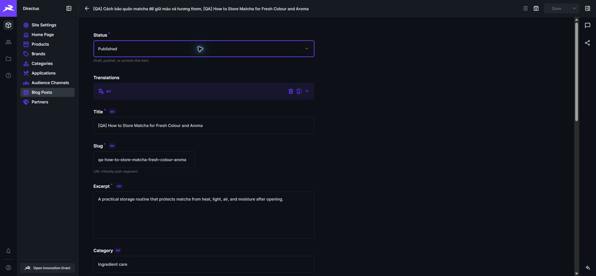

*Ảnh giao diện 2 — Bản ghi mới cần có nội dung đầy đủ và trạng thái đúng trước khi rời trang.*

## Hai mục đơn lẻ

Hai mục dưới đây chỉ có một bản ghi. Không chọn **Tạo mới**; hãy mở bản ghi hiện có và cập nhật cẩn thận.

### Site Settings

**Mục đích:** thông tin dùng cho toàn website.

**Điền và kiểm tra:**

- Trong phần bản dịch, điền **Tên website (Site Name)** và **Mô tả website (Site Description)** cho tiếng Anh rồi tiếng Việt. Điền **Nội dung chân trang (Footer Copy)** khi cần.
- Cập nhật thông tin liên hệ khi được giao. Không thay dữ liệu nếu chưa được xác nhận.
- Chọn logo trong **Public CMS**. Kiểm tra logo đủ rõ trên nền sáng và tối của website.

**Lưu và xuất bản:** giữ nguyên trạng thái hiện tại, chọn **Lưu** và mở trang chủ ở cả hai ngôn ngữ để kiểm tra tên website, chân trang và logo. Nếu mục đang **Draft** do người phụ trách chuẩn bị, chỉ chuyển **Published** sau khi đã đọc lại hai ngôn ngữ.

### Home Page

**Mục đích:** nội dung mở đầu và phần biên tập trên trang chủ.

**Điền và kiểm tra:**

- Chọn **Sản phẩm nổi bật (Featured Product)** đã **Published**.
- Chọn **Ảnh mở đầu (Hero Image)** và **Ảnh phần biên tập (Editorial Image)** từ **Public CMS**.
- Điền lần lượt tiếng Anh rồi tiếng Việt: dòng mở đầu, tiêu đề, nội dung mở đầu, tiêu đề và nội dung phần biên tập.
- Điền **Mô tả ảnh mở đầu (Hero Image Alt)** và **Mô tả ảnh phần biên tập (Editorial Image Alt)** có ý nghĩa ở từng ngôn ngữ.

**Lưu và xuất bản:** giữ nguyên trạng thái hiện tại, chọn **Lưu** và mở hai trang chủ để xem tiêu đề, ảnh và liên kết sản phẩm. Nếu mục đang **Draft** do người phụ trách chuẩn bị, chỉ chuyển **Published** sau khi đã kiểm tra ảnh, mô tả ảnh và sản phẩm nổi bật.

## Bảy nhóm nội dung lặp lại

Với mỗi nhóm, tạo mới theo luồng **Draft** → kiểm tra → **Published** → mở website. Khi sửa bản ghi đang **Published**, giữ nguyên trạng thái, lưu và kiểm tra website. Chỉ dùng **Archived** khi muốn gỡ mục.

### Products

**Mục đích:** sản phẩm hiển thị trong danh mục và trang chi tiết.

**Trường cần điền:**

- Chọn **Thương hiệu (Brand)**. Đây là trường bắt buộc.
- Chọn **Ảnh (Image)** trong **Public CMS**; điền **Mô tả ảnh (Image Alt)** có ý nghĩa ở cả hai ngôn ngữ.
- Điền tiếng Anh rồi tiếng Việt: tên, **Đường dẫn (Slug)**, mô tả, xuất xứ, quy cách, nhãn bảo quản và nhiệt độ bảo quản.
- Nhập **Lợi ích (Benefits)** thành từng lợi ích ngắn. Đây là trường bắt buộc.

**Trường đặc biệt:** gắn **Categories**, **Applications** và **Audience Channels** đúng với sản phẩm. Chọn **Sản phẩm nổi bật (Featured)** khi sản phẩm cần nổi bật.

**Lưu, xuất bản và kiểm tra:** khi tạo mới, lưu **Draft**, kiểm tra thương hiệu, phân loại, ứng dụng, kênh khách hàng và hình liên quan rồi xuất bản. Khi sửa mục **Published**, giữ nguyên trạng thái và lưu. Sau đó mở trang danh mục và trang chi tiết bằng tiếng Anh và tiếng Việt.

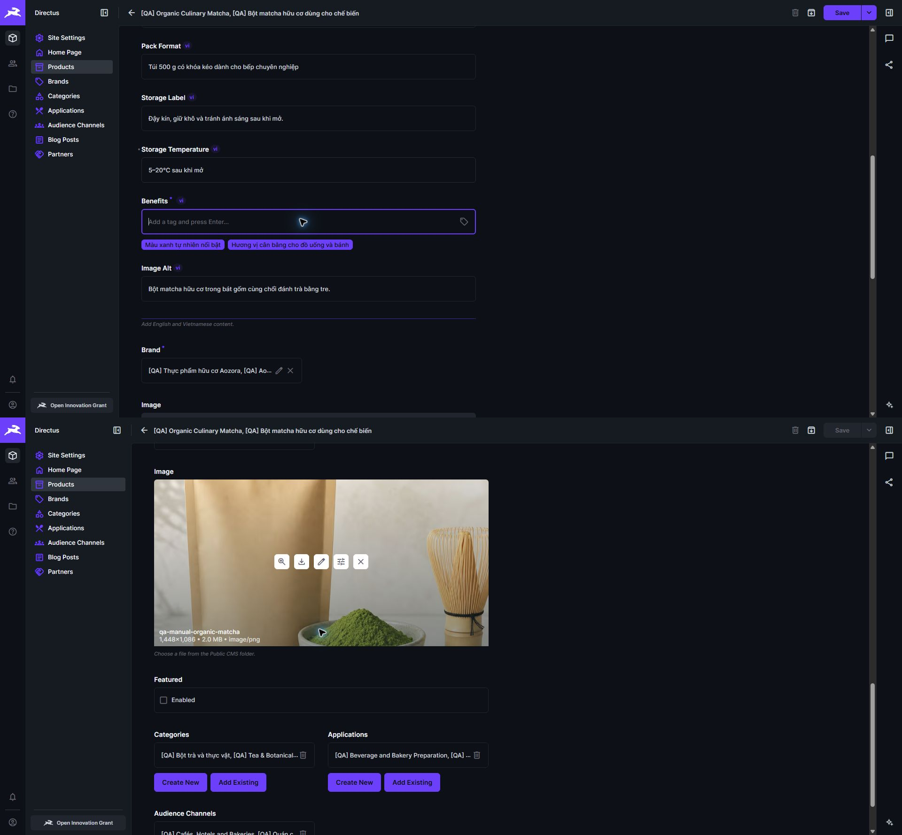

*Ảnh giao diện 5 — Kiểm tra quy cách, bảo quản, lợi ích, mô tả ảnh, thương hiệu và ảnh sản phẩm trước khi xuất bản.*

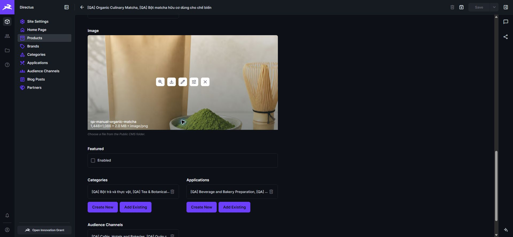

*Ảnh giao diện 6 — Gắn đúng ảnh, phân loại, ứng dụng và kênh khách hàng cho sản phẩm.*

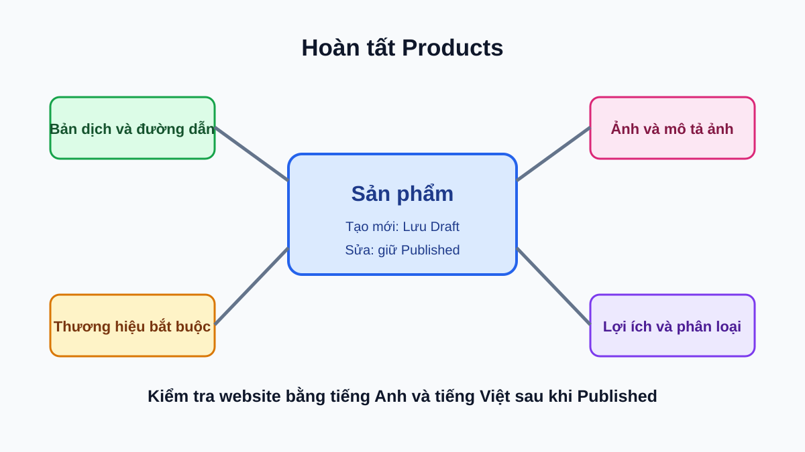

*Hình 3. Hoàn tất bản dịch, thương hiệu, ảnh, lợi ích và các quan hệ trước khi xuất bản sản phẩm.*

### Brands

**Mục đích:** thương hiệu dùng để tổ chức sản phẩm.

**Trường cần điền:** điền tiếng Anh rồi tiếng Việt: tên, **Đường dẫn (Slug)**, mô tả, xuất xứ và **Mô tả ảnh (Image Alt)**. Chọn **Ảnh (Image)** trong **Public CMS**.

**Trường đặc biệt:** dùng **Màu nhấn (Accent)** khi được giao. Danh sách sản phẩm liên quan cho biết các sản phẩm đang dùng thương hiệu này.

**Lưu, xuất bản và kiểm tra:** khi tạo mới, lưu **Draft**, xem tên, đường dẫn, ảnh và sản phẩm liên quan rồi xuất bản. Khi sửa mục **Published**, giữ nguyên trạng thái và lưu. Mở trang thương hiệu ở hai ngôn ngữ.

### Categories

**Mục đích:** nhóm để người xem duyệt sản phẩm.

**Trường cần điền:** điền tiếng Anh rồi tiếng Việt: tên, **Đường dẫn (Slug)**, mô tả và **Mô tả ảnh (Image Alt)**. Chọn **Ảnh (Image)** trong **Public CMS**.

**Trường đặc biệt:** danh sách sản phẩm liên quan cho biết sản phẩm thuộc nhóm này.

**Lưu, xuất bản và kiểm tra:** khi tạo mới, lưu **Draft**, kiểm tra tên, đường dẫn, ảnh và sản phẩm phù hợp rồi xuất bản. Khi sửa mục **Published**, giữ nguyên trạng thái và lưu. Mở trang danh mục và lọc sản phẩm ở hai ngôn ngữ.

### Applications

**Mục đích:** cách sử dụng sản phẩm.

**Trường cần điền:** điền tiếng Anh rồi tiếng Việt: tên, **Đường dẫn (Slug)** và mô tả.

**Trường đặc biệt:** danh sách sản phẩm liên quan cho biết các sản phẩm liên quan.

**Lưu, xuất bản và kiểm tra:** khi tạo mới, lưu **Draft**, kiểm tra tên, đường dẫn và sản phẩm liên quan rồi xuất bản. Khi sửa mục **Published**, giữ nguyên trạng thái và lưu. Mở khu vực ứng dụng trên website ở hai ngôn ngữ.

### Audience Channels

**Mục đích:** kênh khách hàng mà sản phẩm phục vụ.

**Trường cần điền:** điền tiếng Anh rồi tiếng Việt: tên, **Đường dẫn (Slug)** và mô tả.

**Trường đặc biệt:** danh sách sản phẩm liên quan cho biết các sản phẩm liên quan.

**Lưu, xuất bản và kiểm tra:** khi tạo mới, lưu **Draft**, kiểm tra tên, đường dẫn và sản phẩm liên quan rồi xuất bản. Khi sửa mục **Published**, giữ nguyên trạng thái và lưu. Mở khu vực kênh khách hàng ở hai ngôn ngữ.

### Blog Posts

**Mục đích:** bài viết biên tập có ngày đăng và thời gian đọc.

**Trường cần điền:**

- Điền tiếng Anh rồi tiếng Việt: tiêu đề, **Đường dẫn (Slug)**, **Tóm tắt (Excerpt)**, thể loại, **Nội dung (Body)** và **Mô tả ảnh (Image Alt)**. Tiêu đề, đường dẫn, tóm tắt và nội dung là bắt buộc.
- Viết **Nội dung (Body)** bằng vùng soạn thảo định dạng. Dùng tiêu đề, đoạn văn và danh sách rõ ràng; đọc lại ngay trong vùng soạn thảo trước khi lưu, rồi kiểm tra website sau khi xuất bản.
- Chọn **Ảnh (Image)** trong **Public CMS**. Đặt **Ngày xuất bản (Published At)** đúng ngày cần hiển thị và **Thời gian đọc (Reading Minutes)** phù hợp với độ dài bài. Hai trường này bắt buộc khi xuất bản.

**Lưu, xuất bản và kiểm tra:** khi tạo mới, lưu **Draft**, đọc lại hai bản dịch, xem bố cục nội dung định dạng, ảnh, ngày đăng và thời gian đọc rồi xuất bản. Khi sửa mục **Published**, giữ nguyên trạng thái và lưu. Mở bài viết ở hai ngôn ngữ và kiểm tra tiêu đề, ảnh, tóm tắt, nội dung, ngày và thời gian đọc.

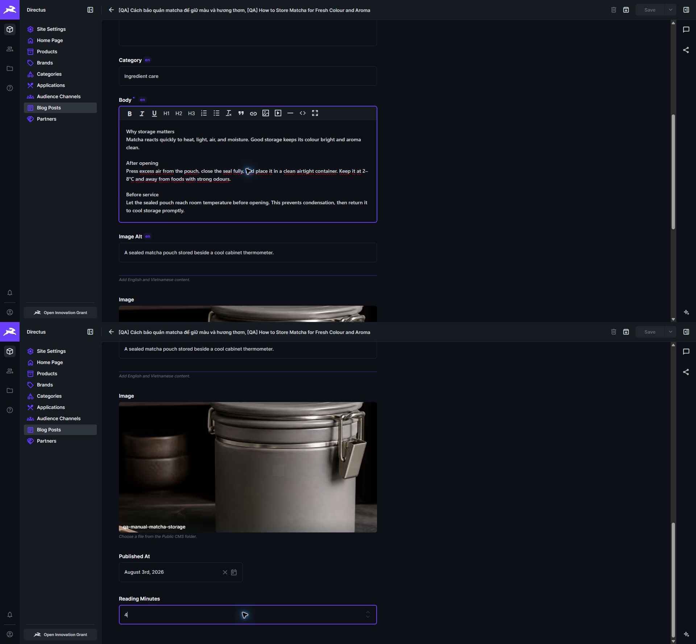

*Ảnh giao diện 8 — Đọc lại nội dung định dạng, mô tả ảnh, ảnh minh họa, ngày xuất bản và thời gian đọc trước khi lưu.*

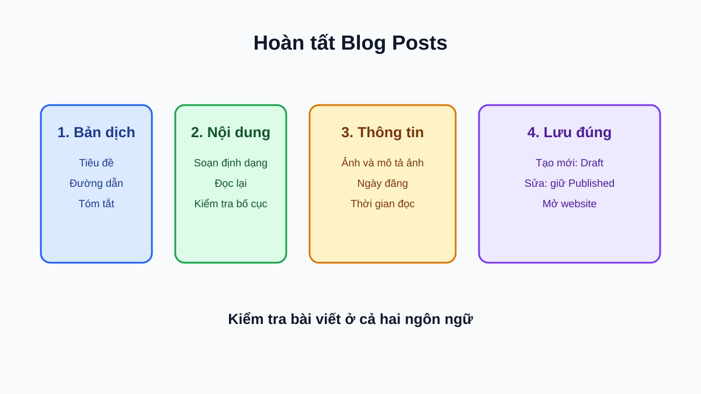

*Hình 4. Soạn hai bản ngôn ngữ, kiểm tra nội dung định dạng và các thông tin hiển thị của bài viết.*

### Partners

**Mục đích:** đối tác, logo và liên kết nguồn.

**Trường cần điền:** điền tiếng Anh rồi tiếng Việt: tên và **Mô tả logo (Logo Alt)**. Hai trường này bắt buộc. Chọn **Logo** trong **Public CMS**.

**Trường đặc biệt:** chọn **Nhóm (Group)** từ các lựa chọn có sẵn. Đây là trường bắt buộc khi xuất bản. Điền **Liên kết nguồn (Source URL)** khi có nguồn cần mở.

**Lưu, xuất bản và kiểm tra:** khi tạo mới, lưu **Draft**, kiểm tra logo, mô tả logo, nhóm và liên kết rồi xuất bản. Khi sửa mục **Published**, giữ nguyên trạng thái và lưu. Mở khu vực đối tác để kiểm tra logo và liên kết.

## Điều kiện để Published

Trước khi chuyển nội dung mới sang **Published**, hoặc trước khi lưu nội dung đang **Published**, kiểm tra các điều kiện sau. Tất cả bản dịch được nêu đều cần tiếng Anh và tiếng Việt.

| Nhóm | Điều kiện bắt buộc khi Published |
| --- | --- |
| **Site Settings** | Tên website và mô tả website ở hai ngôn ngữ. Logo là tùy chọn; nếu chọn logo, dùng **Public CMS**. |
| **Home Page** | Ảnh mở đầu và ảnh phần biên tập trong **Public CMS**, mô tả hai ảnh ở hai ngôn ngữ; sản phẩm nổi bật đang **Published**. |
| **Brands** và **Categories** | Tên, đường dẫn, mô tả ảnh ở hai ngôn ngữ; ảnh trong **Public CMS**. |
| **Products** | Tên, đường dẫn, lợi ích và mô tả ảnh ở hai ngôn ngữ; ảnh trong **Public CMS**; thương hiệu đang **Published**. Mọi phân loại, ứng dụng hoặc kênh khách hàng đã chọn cũng phải **Published**. |
| **Applications** và **Audience Channels** | Tên và đường dẫn ở hai ngôn ngữ. |
| **Blog Posts** | Tiêu đề, đường dẫn, tóm tắt, nội dung và mô tả ảnh ở hai ngôn ngữ; ảnh trong **Public CMS**; ngày xuất bản và thời gian đọc. |
| **Partners** | Tên và mô tả logo ở hai ngôn ngữ; logo trong **Public CMS**; nhóm từ lựa chọn có sẵn. |

## Nội dung song ngữ và đường dẫn

Mỗi mục có phần bản dịch. Luôn điền theo cùng thứ tự để không bỏ sót trường:

1. Chọn tiếng Anh. Điền tên hoặc tiêu đề, đường dẫn, mô tả hoặc nội dung, rồi văn bản thay thế ảnh khi có.
2. Chọn tiếng Việt. Điền đúng các trường tương ứng.
3. So sánh tên, thông tin và ảnh của hai bản. Không để một bản chỉ có tiêu đề trong khi bản kia đã có đủ nội dung.
4. Kiểm tra đường dẫn của từng ngôn ngữ. Dùng chữ thường, không dấu, các từ cách nhau bằng dấu gạch nối; ví dụ `tra-xanh-huu-co`.
5. Nếu đang tạo mới, lưu **Draft**. Nếu đang sửa mục **Published**, giữ **Published** rồi lưu. Kết quả: hai bản dịch sẵn sàng để kiểm tra.

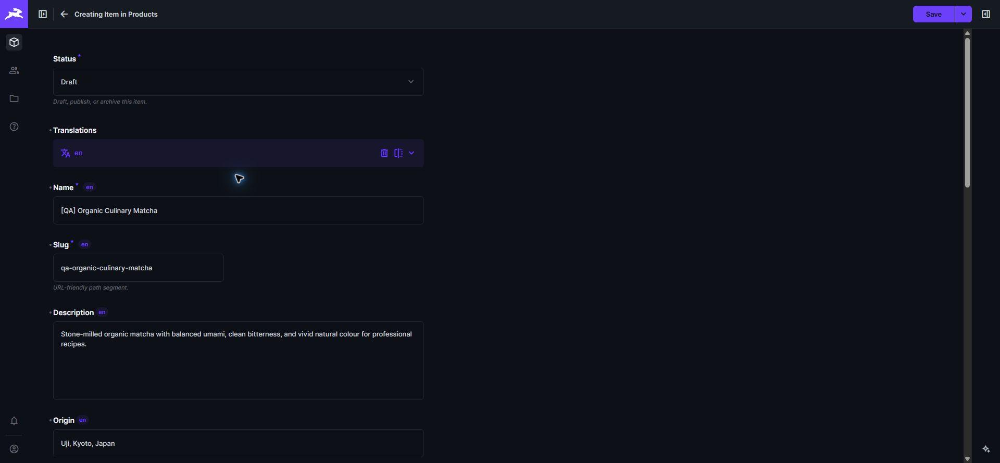

*Ảnh giao diện 3 — Hoàn tất các trường của bản tiếng Anh trước khi chuyển sang tiếng Việt.*

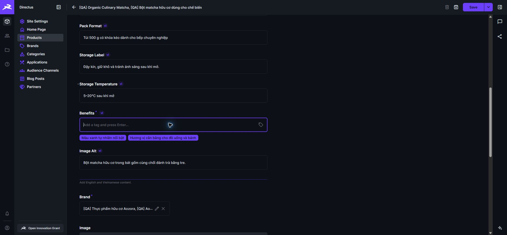

*Ảnh giao diện 4 — Điền đủ thông tin tương ứng trong bản tiếng Việt và đọc lại trước khi lưu.*

Văn bản thay thế phải nói ảnh cho thấy gì hoặc logo thuộc về ai. Ví dụ: “Hộp trà xanh đặt trên bàn gỗ”, không phải “ảnh màu xanh”.

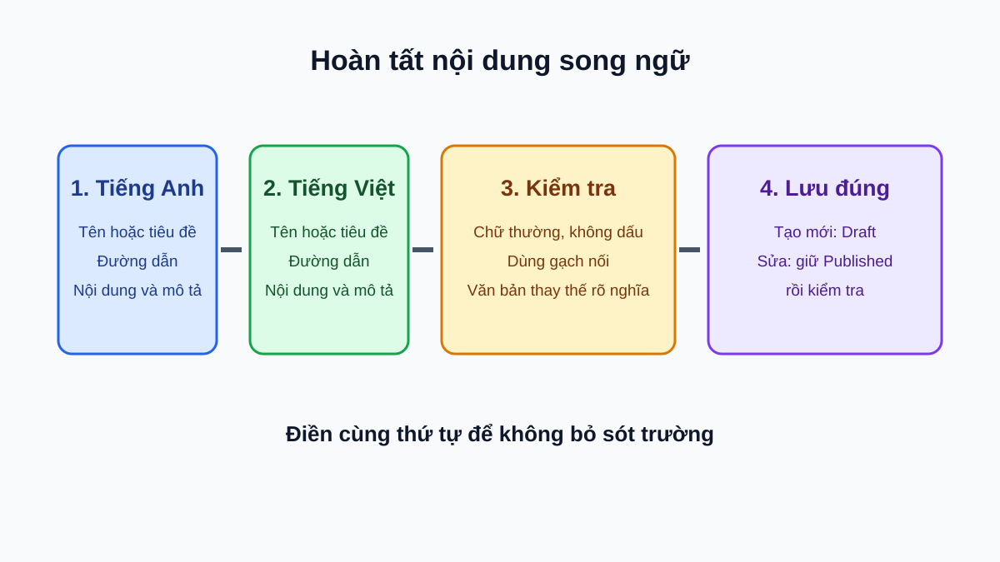

*Hình 5. Hoàn tất từng trường ở tiếng Anh rồi tiếng Việt trước khi chuyển trạng thái.*

## Hình ảnh trong Public CMS

1. Ở trường hình, chọn ảnh hiện có hoặc chọn tải ảnh lên.
2. Chọn thư mục **Public CMS**. Không chọn thư mục khác.
3. Đặt tên tệp dễ nhận biết. Trong ví dụ này, ảnh sản phẩm có tên `qa-manual-organic-matcha` và ảnh bài viết có tên `qa-manual-matcha-storage`. Chọn ảnh cần dùng.
4. Trở lại bản ghi, điền văn bản thay thế theo từng ngôn ngữ.
5. Nếu đang tạo mới, lưu **Draft**. Nếu đang sửa mục **Published**, giữ **Published** rồi lưu và xem lại ảnh, logo hoặc phần minh họa trên website.

Chỉ chọn hoặc tải ảnh vào **Public CMS**. Nếu không thấy thư mục này hoặc không thể chọn ảnh đã tải, báo quản trị viên.

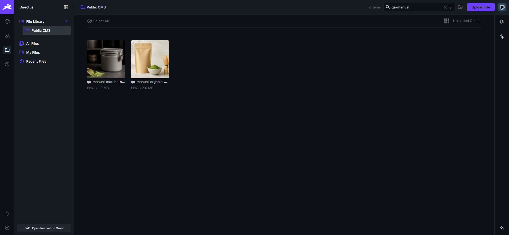

*Ảnh giao diện 7 — Tìm `qa-manual-organic-matcha` và `qa-manual-matcha-storage` trong Public CMS, rồi kiểm tra đúng ảnh trước khi chọn.*

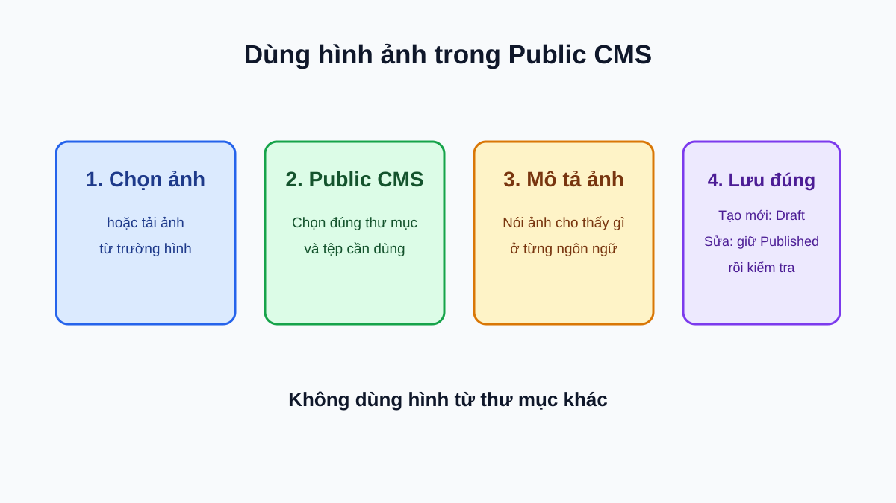

*Hình 6. Hình dùng trên website phải được chọn hoặc tải vào Public CMS và có văn bản thay thế.*

## Quan hệ nội dung

Quan hệ giúp nội dung xuất hiện đúng nơi. Thay đổi quan hệ có thể làm thay đổi nhiều trang.

- Với **Products**, chọn một **Thương hiệu (Brand)**, rồi gắn đúng **Categories**, **Applications** và **Audience Channels**.
- Với **Home Page**, chỉ chọn **Sản phẩm nổi bật (Featured Product)** đã **Published**.
- Với **Brands**, **Categories**, **Applications** và **Audience Channels**, xem danh sách sản phẩm liên quan trước khi đổi tên, đường dẫn hoặc lưu trữ.

Trước khi bỏ một quan hệ, mở sản phẩm hoặc trang liên quan để chắc chắn nội dung không mất khỏi nơi cần hiển thị.

### Trước khi chuyển nội dung phụ thuộc sang Draft hoặc Archived

**Cảnh báo:** tháo quan hệ trước khi hạ trạng thái để tránh làm mất nội dung ngoài ý muốn trên website.

Nếu **Brand**, **Category**, **Application** hoặc **Audience Channel** đang được một **Product** Published sử dụng:

1. Mở danh sách sản phẩm liên quan và mở từng **Product** đang **Published**.
2. Với **Brand**, chọn một **Brand** khác đang **Published**; không để trống vì Brand là bắt buộc.
3. Với **Category**, **Application** hoặc **Audience Channel**, thay hoặc bỏ quan hệ nếu đúng với sản phẩm.
4. Lưu từng Product và kiểm tra website. Nếu Product cũng cần gỡ, xử lý **Featured Product** theo phần bên dưới khi áp dụng, rồi chuyển Product sang **Archived** trước.
5. Khi không còn Product Published sử dụng mục đó, mới chuyển mục sang **Draft** hoặc **Archived**.

Nếu **Product** đang là **Featured Product** của **Home Page** Published:

1. Mở **Home Page**.
2. Chọn một Product khác đang **Published** ở **Featured Product**.
3. Lưu Home Page và kiểm tra trang chủ ở hai ngôn ngữ.
4. Sau đó mới chuyển Product cũ sang **Draft** hoặc **Archived**.

Nếu hệ thống chặn thao tác, đọc tên nhóm hoặc nội dung liên kết trong thông báo, cập nhật nội dung phụ thuộc rồi thử lại.

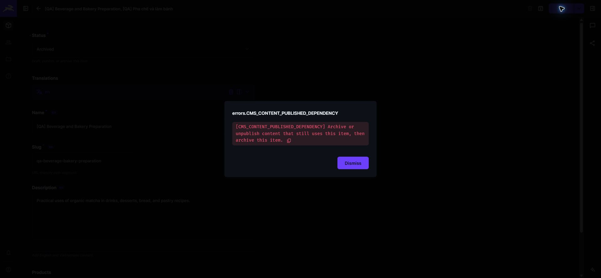

*Ảnh giao diện 10 — Khi thấy thông báo phụ thuộc, cập nhật nội dung đang liên kết rồi mới thử lưu trữ lại.*

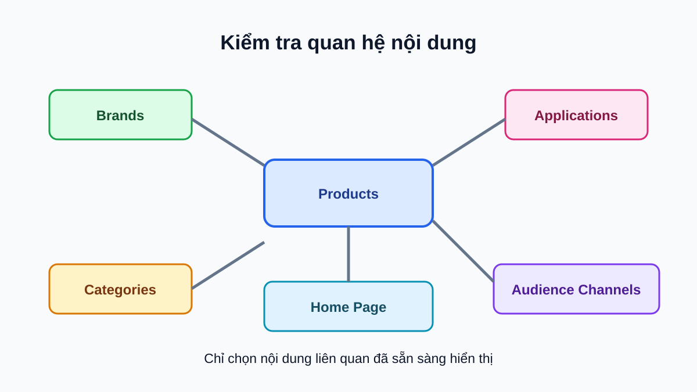

*Hình 7. Kiểm tra các mục liên quan đã sẵn sàng trước khi xuất bản sản phẩm hoặc chọn sản phẩm nổi bật.*

## Quy trình xuất bản và lưu trữ

1. Với nội dung mới, lưu ở **Draft**. Với nội dung đang **Published**, giữ nguyên **Status**.
2. Kiểm tra điều kiện trong mục [Điều kiện để Published](#điều-kiện-để-published).
3. Chỉ với nội dung mới, chuyển **Status** sang **Published** rồi lưu. Với nội dung đang **Published**, chỉ cần lưu thay đổi.
4. Mở website bằng tiếng Anh và tiếng Việt. Kiểm tra tiêu đề, đường dẫn, ảnh, liên kết và vị trí hiển thị.
5. Khi chủ ý gỡ nội dung, chuyển sang **Archived** rồi kiểm tra website không còn hiển thị mục đó.

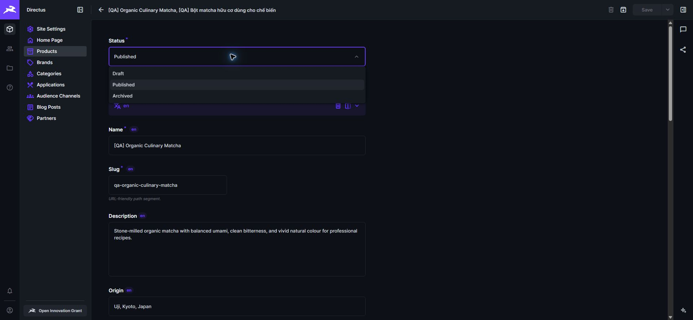

*Ảnh giao diện 9 — Chọn Published sau khi hoàn tất kiểm tra; chỉ chọn Archived khi chủ ý gỡ nội dung.*

**Cảnh báo:** chỉ xuất bản khi cả nội dung và mục liên quan đã sẵn sàng công khai. Nếu thấy lỗi sau khi xuất bản, sửa nhưng giữ **Published** khi nội dung vẫn đầy đủ; chỉ dùng **Archived** để chủ ý gỡ.

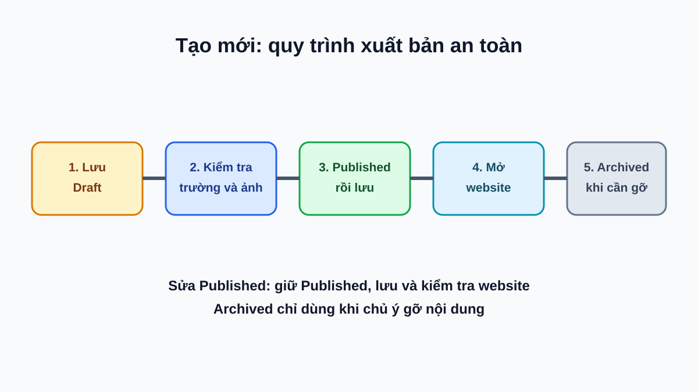

*Hình 8. Luôn kiểm tra website sau khi xuất bản hoặc lưu trữ.*

## Lỗi thường gặp

| Dấu hiệu | Tự xử lý | Báo quản trị viên khi |
| --- | --- | --- |
| Không thể xuất bản | Hoàn tất tiếng Anh, tiếng Việt, trường bắt buộc, ảnh và quan hệ. Nội dung mới giữ Draft; nội dung Published giữ Published rồi lưu lại. | Đã hoàn tất nhưng vẫn không thể lưu hoặc xuất bản. |
| Thiếu ảnh hoặc văn bản thay thế | Chọn ảnh trong Public CMS và thêm mô tả có ý nghĩa ở hai ngôn ngữ. | Không thấy Public CMS hoặc không chọn được ảnh. |
| Đường dẫn trùng | Đổi đường dẫn thành giá trị khác, chữ thường, không dấu, dùng gạch nối. | Đường dẫn khác vẫn không lưu được. |
| Sản phẩm hoặc bài viết chưa hiện | Kiểm tra Status là Published, hai bản dịch, ảnh và mục liên quan. | Đã kiểm tra nhưng website vẫn chưa cập nhật. |
| Không thể chuyển Draft hoặc Archived vì còn liên kết | Đọc tên nội dung liên kết trong thông báo. Thay hoặc bỏ quan hệ ở Product Published; nếu là Featured Product, chọn Product Published khác cho Home Page rồi lưu và thử lại. | Đã cập nhật mọi nội dung phụ thuộc nhưng vẫn bị chặn. |
| Không thấy nút xóa | Dùng Archived để gỡ mục. | Cần xóa vĩnh viễn hoặc khôi phục dữ liệu không có trong mục. |
| Không thấy nhóm nội dung | Tải lại trang và kiểm tra đúng tên nhóm ở thanh điều hướng. | Vẫn không truy cập được nhóm hoặc không có quyền lưu. |

## Danh sách kiểm tra

### Trước khi xuất bản

- [ ] Nếu là nội dung mới, đã lưu **Draft**; nếu đang Published, sẽ giữ nguyên **Published** khi lưu.
- [ ] Đã hoàn tất tiếng Anh và tiếng Việt theo cùng thứ tự.
- [ ] Đã kiểm tra đường dẫn: chữ thường, không dấu, có gạch nối, không trùng.
- [ ] Đã chọn ảnh hoặc logo trong **Public CMS** và điền văn bản thay thế có ý nghĩa.
- [ ] Đã kiểm tra trường bắt buộc, ngày đăng và thời gian đọc khi có.
- [ ] Đã kiểm tra thương hiệu, phân loại, ứng dụng, kênh khách hàng hoặc sản phẩm liên quan đã sẵn sàng.

### Sau khi xuất bản hoặc lưu trữ

- [ ] Đã mở website ở tiếng Anh và tiếng Việt.
- [ ] Đã kiểm tra tên, đường dẫn, ảnh, logo, liên kết, ngày đăng và vị trí hiển thị.
- [ ] Đã xác nhận nội dung lưu trữ không còn hiển thị trên website.
- [ ] Đã giữ mục **Published** khi sửa lỗi; chỉ dùng **Archived** khi cần gỡ mục.

## Khi nào cần báo quản trị viên

Báo quản trị viên khi không thể truy cập nhóm nội dung, không thấy **Public CMS**, không thể lưu hoặc xuất bản sau khi đã kiểm tra, hoặc cần thay đổi quyền. Nêu tên nhóm nội dung, tên mục và thao tác vừa thực hiện. Không gửi thông tin đăng nhập.
